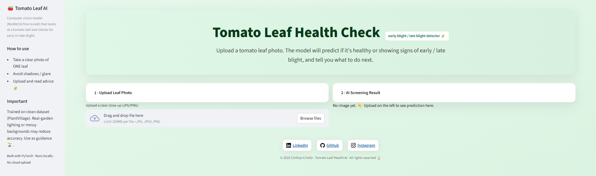
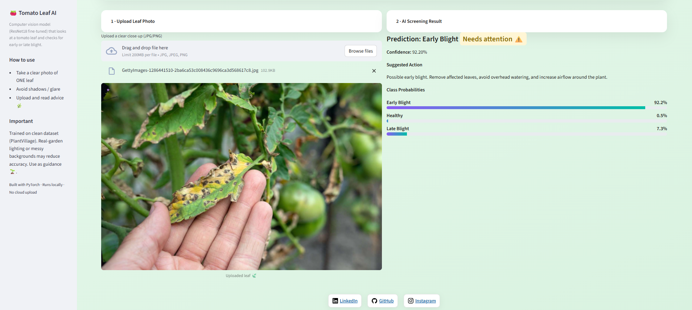

# 🍅 Project: Tomato Leaf Health Diagnostics (Computer Vision)

An end-to-end **plant health assistant** for tomato leaves built with **PyTorch**, **FastAPI**, and **Streamlit**.  
The model detects **early blight**, **late blight**, or **healthy** leaves using the [PlantVillage dataset](https://www.kaggle.com/datasets/charuchaudhry/plantvillage-tomato-leaf-dataset).

---

## 🌿 Overview

- **Goal:** Early detection of crop disease to reduce pesticide overuse and limit crop loss.  
- **Model:** Fine-tuned **ResNet18** achieving ~96% test accuracy.  
- **Dataset:** Balanced 3-class subset (Healthy / Early Blight / Late Blight).  
- **Compute:** Trained on GPU via **Snellius HPC (SURF NL)**.  
- **Pipeline:** Automated dataset download, label normalization, and deterministic train/val/test splits.  
- **Deployment:**  
  - 🖥️ **Streamlit Web App** — upload a leaf image, get diagnosis, confidence, and care advice.  
  - ⚙️ **FastAPI Endpoint** (`POST /predict`) — returns JSON predictions for integration into other systems.  

---

## 🧠 Model Architecture

| Component | Description |
|------------|-------------|
| **Base** | ResNet18 pretrained on ImageNet |
| **Training** | Cross-entropy loss, Adam optimizer |
| **Accuracy** | ~96% test accuracy |
| **Input size** | 256×256 RGB |
| **Output classes** | `healthy`, `early_blight`, `late_blight` |

---

## 💡 Web App Demo

### 🌱 Landing Page & Upload Interface
Users upload a single tomato leaf photo and receive instant AI feedback on its health condition.



---

### 🍅 Example Prediction: Early Blight Detected
The app displays class probabilities, confidence score, and actionable plant care tips.



> _Built with Streamlit · Local inference for privacy · Soft green UI inspired by plant life._

---

## 🧩 Repository Structure

```text
plant-health-ai/
├─ data/
│  ├─ tmp/              # Kaggle raw download (auto-created)
│  ├─ raw/              # normalized dataset folders
│  └─ splits/           # deterministic train/val/test
│      ├─ train/
│      ├─ val/
│      └─ test/
├─ models/
│  ├─ model_best.pth    # trained checkpoint
│  └─ model_final.pth   # optional
├─ src/
│  ├─ download_and_prepare.py  # data pipeline automation
│  ├─ train.py                 # training script
│  ├─ inference.py             # CLI testing (optional)
│  └─ utils.py                 # helper functions
├─ app/
│  └─ app.py            # Streamlit web interface
├─ api/
│  └─ app.py            # FastAPI endpoint (JSON inference)
├─ notebooks/
│  └─ evaluation.ipynb  # performance metrics & confusion matrix
├─ environment.yml
├─ README.md
└─ .gitignore
